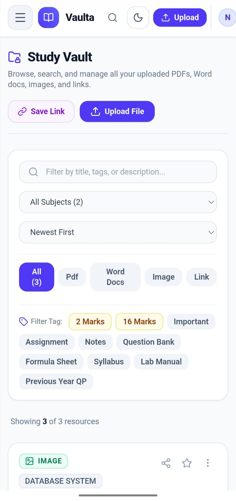
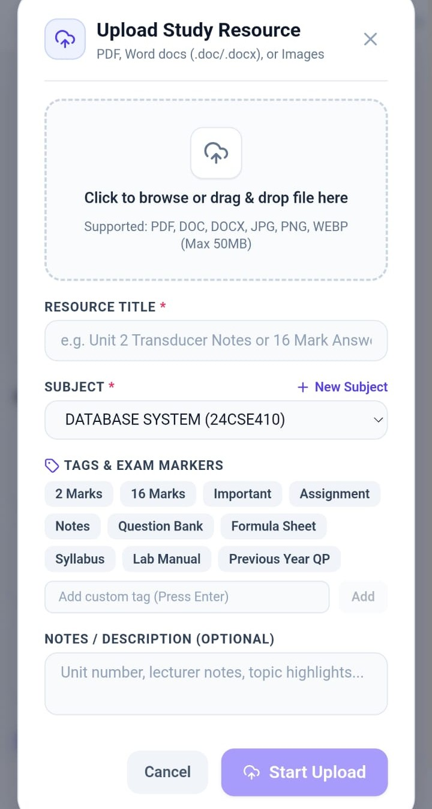
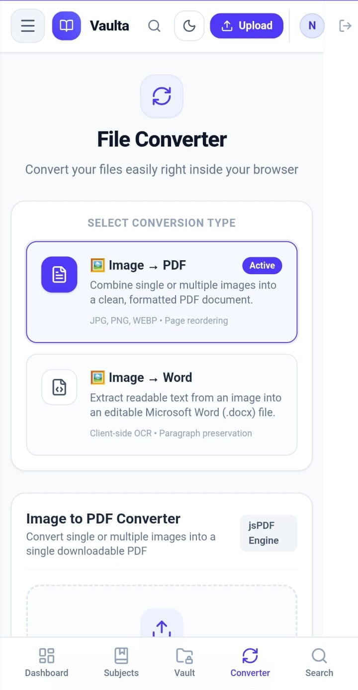
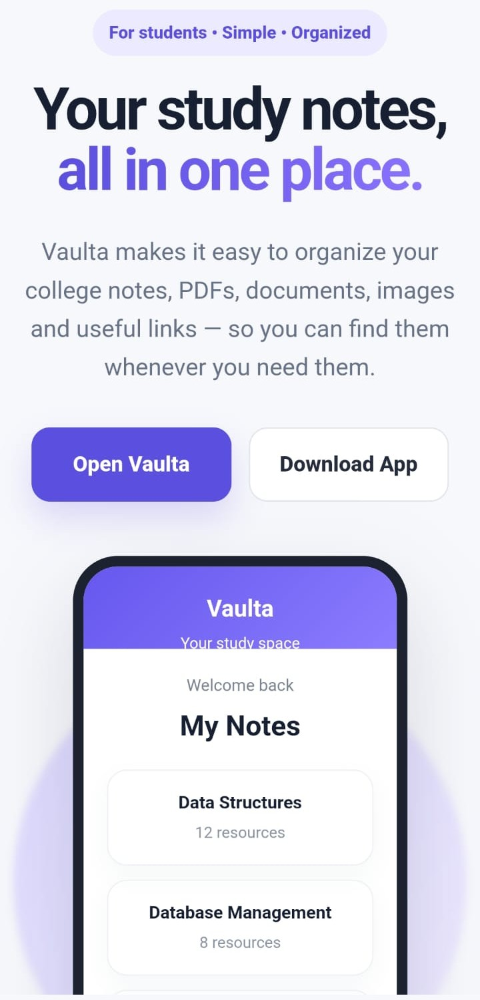

# 📚 Vaulta – Student Notes Organizer

> **Study. Organize. Access Anywhere.**

Vaulta is a student-focused notes and study resource organizer that helps students store, organize, search, view, and share their academic materials in one place.

Instead of keeping notes across WhatsApp groups, Telegram, phone storage, cloud drives, and chat links, Vaulta provides a centralized space to manage study resources subject-wise.

---

## 🌐 Live Application

### Web App
https://vaulta.ai.studio

### Project Website & Android Download
https://vaulta-organizer.netlify.app/

---

## 🎯 Problem

Students often store study materials in multiple places:

- WhatsApp groups
- Telegram
- Google Drive
- Phone storage
- Chat conversations
- Different folders

As a result, important notes and resources can become difficult to find, especially during exam preparation.

## 💡 Solution

Vaulta provides a centralized study-resource organizer where students can:

- Organize resources by subject
- Upload different file formats
- Save useful links
- Search resources quickly
- View and download materials
- Share resources with others

---

## ✨ Features

- 🔐 Student authentication
- 📚 Subject-wise resource organization
- 📄 PDF, Word, and image uploads
- 🔗 Save study links
- 🏷️ Resource categories such as 2 Marks, 16 Marks, Questions, etc.
- 🔎 Search resources
- ⭐ Favorites
- 👤 Student profile
- 🌓 Light and dark mode
- 📱 Progressive Web App support
- 📲 Android application
- 🔄 Image-to-PDF conversion
- 📝 Image-to-Word conversion
- 📤 Resource sharing
- 📥 View and download study materials

---

## 🛠️ Technologies Used

### Frontend

- React
- TypeScript
- Vite
- HTML5
- CSS3

### Backend & Services

- Firebase Authentication
- Firebase Firestore
- Supabase Storage

### Mobile

- Capacitor
- Android

### Application Features

- Progressive Web App (PWA)
- Responsive UI
- File management
- Document viewing
- Resource sharing

---

## 🏗️ Project Structure

```text
vaulta-notes-organizer/
│
├── android/                 # Android application
│
├── public/                  # Public assets, icons and PWA files
│
├── src/
│   ├── components/
│   │   ├── auth/            # Authentication
│   │   ├── common/          # Common UI components
│   │   ├── converter/       # File conversion
│   │   ├── dashboard/       # Dashboard
│   │   ├── favorites/       # Favorites
│   │   ├── profile/         # Profile
│   │   ├── resources/       # Resource management
│   │   ├── search/          # Search
│   │   ├── shared/          # Shared resources
│   │   ├── subjects/        # Subject management
│   │   ├── upload/          # Upload functionality
│   │   ├── vault/           # Vault
│   │   └── viewers/         # File viewers
│   │
│   ├── context/             # React contexts
│   ├── hooks/               # Custom hooks
│   ├── lib/                 # Firebase and Supabase
│   ├── services/            # Application services
│   ├── types/               # Type definitions
│   ├── App.tsx
│   └── main.tsx
│
├── .gitignore
├── capacitor.config.ts
├── firestore.rules
├── package.json
├── tsconfig.json
└── vite.config.ts
🚀 Getting Started
Prerequisites

Make sure you have installed:

Node.js
npm
Git
1. Clone the repository
git clone https://github.com/Niranjana-M/vaulta-notes-organizer.git
2. Open the project
cd vaulta-notes-organizer
3. Install dependencies
npm install
4. Configure the required services

Vaulta uses Firebase and Supabase for authentication, database, and storage.

Configure the required project settings and environment variables before running the application locally.

Do not commit private credentials, passwords, service-account files, or secret API keys to GitHub.

5. Start the development server
npm run dev

The terminal will display the local development URL.

📱 Android Application

Vaulta also includes an Android version built using Capacitor.

The Android project is available in:

android/

The Android application can be accessed through the Vaulta project website:

https://vaulta-organizer.netlify.app/

🔐 Security

Vaulta uses Firebase security rules and authentication to control access to application data.

Sensitive local configuration files such as:

.env
.env.local

are excluded from Git version control.

Never commit:

Passwords
Private API keys
Service account credentials
Authentication secrets

📸 Project Preview


Vaulta provides a clean and student-focused interface for managing academic resources.

### Dashboard


### Study Vault



### Upload Resource



### File Converter



### Landing Page



🚧 Project Status

Active Student Project

Vaulta is being continuously improved based on real-world usage and student feedback.

🔮 Future Improvements

Possible future improvements include:

Improved offline functionality
More document formats
Better sharing capabilities
Enhanced resource organization
Usage analytics
Additional mobile improvements
User-requested features based on feedback

👩‍💻 Developer

Niranjana M
B.Tech Computer Science Engineering Student

Interested in:

Software Development
AI-assisted Development
Web & App Development
Cloud Computing
Building practical student-focused solutions

⭐ Feedback

If you try Vaulta, feedback and suggestions are welcome.

Your feedback can help improve Vaulta and make it more useful for students.

📄 License

This project is currently maintained as a personal/student project.
